# DR Fidelity Benchmark — Results Report

*(Markdown rendering of `REPORT.html` — same content, generated together. In tables, **bold** = best in column, *italic* = worst, ⚠ = outright failure flag.)*

*A paper version (arXiv submission in preparation) lives under [`paper/`](paper/); it is frozen at release tag **v1.2.0**, while this report tracks the current committed results.*

Distance-preservation focus · 5 datasets (D=768 · N=1000 · **SNR=1**, realistic additive noise) + a time-series dataset (multi-series random walks: D=50 · N=3000 · clean) · seeds: R=3 (stochastic methods; PCA / Isomap / toorPIA are deterministic; transition — committed tables) · CPU/1-thread · reproducible · [code & data on GitHub](https://github.com/toorpia/dr-fidelity-benchmark).

> **Thesis.** **Shepard ρ (full, p=100)** reflects **global-structure** reproduction. But in high dimensions distances concentrate, so most pairs sit at large distances and the full ρ is dominated by far pairs — the accuracy of **near** distances is buried. We therefore restrict ρ to the **near band**, defined structure-adaptively: the pairwise-distance profile of structured data is multimodal — its **first mode** is the within-structure pairs — and the near band is all pairs up to the density valley where that first mode decays into the tail (pX = the lowest X% of all pairwise distances; the boundary lands at p14–p20 on these datasets; on the clustered datasets the boundary coincides exactly with the true within-cluster pair fraction). It isolates **near-neighbor descriptive power**. Crucially the band uses a **fixed absolute radius for every point**, so it is fair. **recall@k** instead takes each point's own k nearest (a **variable radius**): it over-penalizes near-ties in dense regions and is **favorable to k-NN-based methods (t-SNE/UMAP)** — it is not a fair neighborhood evaluation, and is shown only as a reference. Best value per column is highlighted; bracketed ranges are bootstrap 95% CIs over seeds (deterministic methods show a point value).

PRIMARY · band-Shepard (fixed-radius, fair) · REFERENCE · recall@k etc. (variable-radius k-NN, biased) ·   first-mode near band → p=100 global. The two groups are colored accordingly in every table below.

> **Headline finding.** **PCC crushes dense clusters to points.** It over-compresses the tightest cluster's scale by ≈93× (density) and ≈9× (clusters) relative to the truth (≈1×), destroying each cluster's internal structure — even though its global ρ (full) stays **high** (it is the highest only on density; **toorPIA** leads the global ρ on clusters and transition). toorPIA preserves the within-cluster scale (≈0.4–0.5×) across all three datasets. This scale collapse is invisible to the rank-based Shepard ρ (which is scale-invariant) but is obvious in the Shepard density plots below and is quantified by the tightest-cluster scale column. **toorPIA tops the composite (near + global) ranking on density and clusters; on transition it leads the global ρ but drops to 3rd on the composite** (PCC 1st, t-SNE 2nd — its first-mode near ρ trails there; the transition gallery shows the qualitative geometry this trade-off hides: toorPIA alone renders the seven dense states AND their closed-ring connectivity at once). The fourth dataset ([outliers](#outliers)) asks a different, single-point question — whether one far-away point stays separated — scored by the standard Shepard/stress blocks plus a plain-geometry pair-angle column. There, **toorPIA keeps same-kind anomaly pairs co-directional** (angle ≤ 10°) with three kinds at three separate places, and in the [addplot](#addplot) out-of-sample test (monitoring on an anomaly-free basemap) it is **the only method that plots a never-seen anomaly outside the normal region at all — and its direction points back to the source cluster**; UMAP preserves pairs best in raw terms but attaches them to bulk-cluster edges; t-SNE fuses each pair into one point; **PCC tears same-kind pairs apart** (cohesion ≈650, angles ≈86°); PCA/Isomap send pair members to opposite sides; and t-SNE / PyMDE / PCC cannot perform the add-data operation at all. On the [time-series dataset](#random-walk) (multi-series high-D random walks — the true shape is a star of jagged, mutually orthogonal spokes) **toorPIA leads every trajectory readout** (full ρ 0.924, within-series 0.970, cross-series 0.897), while the neighbor-graph methods keep only the step-level time order (t-SNE 0.951 there) and lose the star arrangement entirely (cross-series ρ 0.366 / 0.477).

## Reading guide — what we measure, and why not recall@k

> **New here?** This benchmark asks one question: when a dimensionality-reduction (DR) method squashes high-dimensional data into a 2-D picture, how faithfully does it keep the original **distances** between points? We run seven methods on synthetic data whose true geometry is known, so each method can be scored against the truth. A good method keeps **near** distances (fine, within-cluster structure) *and* **far** distances (the global layout). Below we explain how we measure that — and why the metric the DR literature usually reaches for is misleading — then show the results dataset by dataset.

### Why the global (full, p=100) Shepard ρ hides near-neighbor structure

The classic global score is the **Shepard ρ**: the rank correlation between every pair's high-D distance and its 2-D distance. The catch is **distance concentration** — in high dimensions almost every pair of points sits at a similar mid-to-far distance, and only a thin sliver of pairs are genuinely close. In the plot below (the `clusters` dataset) the near band (green) is the profile's first mode — the within-cluster pairs, ~14% here — while the bulk of the ≈500,000 pairs piles up far away. Because the full ρ ranks *all* pairs together, near-distance errors are out-voted ~6:1 and averaged away. A method can crush every cluster to a blob yet still post a near-perfect full ρ. To actually see near-neighbor fidelity we restrict ρ to the **first-mode near band**: all pairs up to the density valley where the first mode of the distance profile decays into the tail, judged on one fixed distance radius.

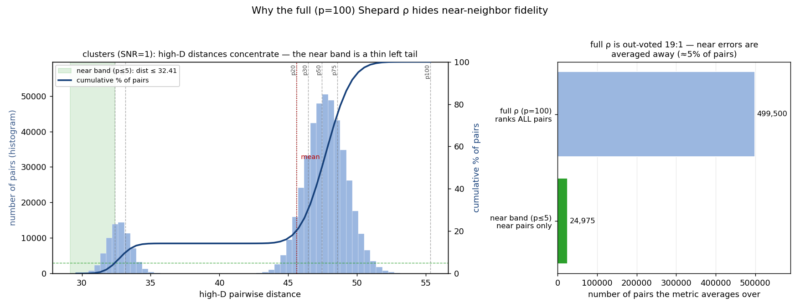
*clusters: most pairs are far (between-cluster); the first-mode near band (within-cluster fine structure, here p14) is the green tail the full ρ averages away.*

### Why recall@k / trustworthiness / continuity are a biased reference

The DR literature's usual *local* metric is **recall@k** (and its cousins trustworthiness and continuity): for each point, how many of its k high-D nearest neighbors are still neighbors in 2-D. Two structural choices make it an unfair test of distance fidelity. **(1) Variable radius** — with a fixed k, a point in a dense region encloses its k neighbors in a tiny radius while a point in a sparse region needs a much larger one (panel 1), so every point is judged on a different distance scale; on real data that radius genuinely varies point-to-point (panel 3). **(2) Hard 0/1 threshold** — the k-th and (k+1)-th neighbors can be almost equidistant, yet one counts fully and the other not at all (panel 2): a tiny coordinate wobble flips membership and the score jumps, even though the actual distances barely moved. Both choices make recall@k structurally favorable to neighbor-graph methods (t-SNE / UMAP) and a poor measure of faithful near-distance reproduction. The fixed-radius first-mode near-band Shepard ρ uses the *same* radius for every point and scores by actual distance, so it has neither problem. We keep recall@k only as a labelled **reference** column.

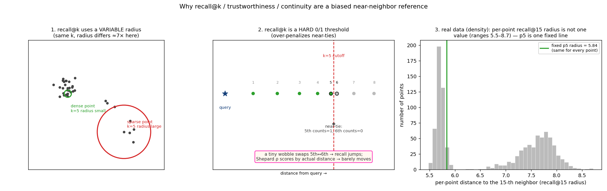
*density: recall@k judges each point on its own radius (panels 1 & 3) with a hard in/out cutoff (panel 2); the fixed-radius band (green line) treats all points the same.*

### Key terms

- **Dimensionality reduction (DR) / embedding** — Mapping each high-D point to a 2-D coordinate for visualization; the 2-D output is the *embedding*.
- **Fidelity** — How well the 2-D distances reproduce the high-D distances.
- **Ground truth — vs-truth / vs-ambient** — Each dataset is built from a known clean geometry, then noise is added. **vs-truth** scores against the clean generating distances; **vs-ambient** scores against the noisy distances the method actually saw.
- **Shepard ρ** — Spearman rank correlation between high-D and 2-D pairwise distances (1 = perfect distance ordering).
- **Distance band (p)** — The pairs whose high-D distance is in the lowest *p*% of all pairs. The **near band** = the profile's first mode (up to its density valley; p14–p20 here); **p=100 (full)** = all pairs = the global number.
- **Stress** — Value-based distance error (lower = better); complements the rank-based Shepard ρ by catching distorted distance *values* (e.g. clusters crushed to points).
- **Over-compression ×** — How much a method shrinks the within-cluster scale vs the truth. ≈1× = preserved; ≫1× = clusters crushed toward points.
- **recall@k / trustworthiness / continuity** — Neighbor-overlap metrics (variable radius, hard cutoff) — shown as a biased reference, not a fair near-distance metric (see above).
- **Outlier ρ (anomaly-pair Shepard ρ)** — The standard Shepard ρ restricted to the pairs where at least one endpoint is a ground-truth outlier — the same statistic as the global and band ρ, with the pair subset selected by endpoint membership instead of by distance percentile. It quantifies exactly the outlier-related blocks of the Shepard density figure and feeds the outliers dataset's third ranking column.
- **SNR** — Signal-to-noise ratio of the added noise; this report uses SNR=1 (realistic).
- **Procrustes stability** — Run-to-run wobble of a stochastic method's embedding after removing the rotation/scale/flip gauge; small = reproducible.

### How to read the ranking tables

> Each per-dataset table has four column groups, left to right: **Ranking score** (composite points — for full ρ and for the first-mode near ρ the 1st→5th method scores 5→1 points; Σ is their sum and rows are sorted by Σ); immediately beside it the PRIMARY ·  **band-Shepard ρ** block (fixed-radius, fair — full·global and near·first-mode) *that the ranking score is computed from*; then **Tightest-cluster scale** (the tight-cluster scale ×); and the REFERENCE ·  **recall@k** block (variable-radius k-NN, biased — greyed out). In every column the **best** value is green and the **worst** is light red. A **darker red** (regardless of rank) flags an outright failure: a **negative** near-band ρ, the table's **worst tightest-cluster crush when it exceeds 5×** (crushing destroys information — it cannot be read back from the map; inflation is legible, if exaggerated), or a **negative anomaly-pair ρ**. In the tightest-cluster column only the value closest to 1 is highlighted (light green); everything below the flag threshold stays uncolored. Note the composite ranking scores **distance fidelity only** (the PRIMARY ρ columns, plus the anomaly-pair ρ on the outliers dataset); the k-NN reference block is deliberately unscored — see the recall@k bias note. Bracketed ranges are bootstrap 95% CIs over seeds (deterministic methods show a single value). The **outliers** dataset adds a purple **outlier ρ** column — the standard Shepard ρ restricted to the anomaly-involving pairs — and a third ranking column scored on it (1st→5 … 5th→1), so the composite Σ there is full + near + outlier.

## density

> Non-uniform density (uniform + tight core + sparse shell). Tests density distortion and the recall@k bias; distance-preservers should win the global/near Shepard bands.

### SNR = 1

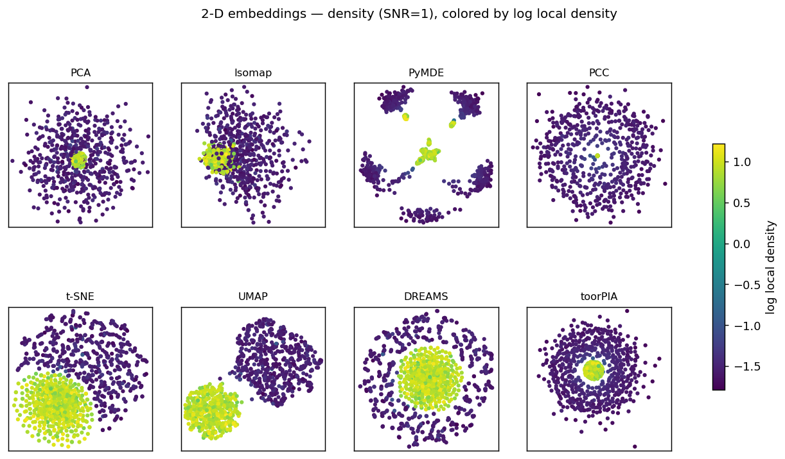
*2-D embeddings colored by the dataset variable*

*Column groups: Distance-fidelity ranking (scores the ρ columns only; 1st→5 … 5th→1 pts) [3 cols] · Band-Shepard ρ — fixed-radius, fair (PRIMARY) [2 cols] · Tightest-cluster scale (× vs overall spread; ≫1 = crushed to a point, ≪1 = inflated) [1 col] · Reference — k-NN-favorable, biased (not a fair neighborhood test) [3 cols]*

| method | full pts | near pts | Σ | full · global | near · first-mode band | tight-cluster scale × | recall@15 | trust@15 | continuity@15 |
|---|---|---|---|---|---|---|---|---|---|
| toorPIA | 4 | **5** | **9** | 0.815 | **0.312** | 0.438 | 0.068 | 0.628 | **0.822** |
| PCC | **5** | *0* | 5 | **0.820 [0.816, 0.824]** | ⚠ **-0.028 [-0.047, -0.002]** | ⚠ **93.468 [93.389, 93.583]** | 0.056 [0.055, 0.059] | 0.603 [0.593, 0.604] | 0.753 [0.749, 0.759] |
| PCA | 3 | 2 | 5 | 0.699 | 0.093 | **0.728** | 0.069 | 0.628 | 0.785 |
| PyMDE | 2 | 3 | 5 | 0.598 [0.598, 0.608] | 0.218 [0.202, 0.254] | 0.460 [0.419, 0.516] | *0.043 [0.041, 0.047]* | *0.568 [0.567, 0.570]* | *0.634 [0.632, 0.646]* |
| t-SNE | *0* | 4 | 4 | 0.300 [0.277, 0.309] | 0.260 [0.259, 0.266] | 0.215 [0.214, 0.216] | **0.254 [0.250, 0.259]** | **0.773 [0.770, 0.779]** | 0.803 [0.798, 0.803] |
| Isomap | 1 | *0* | *1* | 0.559 | ⚠ **-0.038** | 0.383 | 0.060 | 0.601 | 0.776 |
| UMAP | *0* | 1 | *1* | *0.156 [0.154, 0.162]* | 0.055 [0.040, 0.057] | 0.279 [0.275, 0.283] | 0.210 [0.206, 0.213] | 0.733 [0.729, 0.734] | 0.813 [0.812, 0.815] |

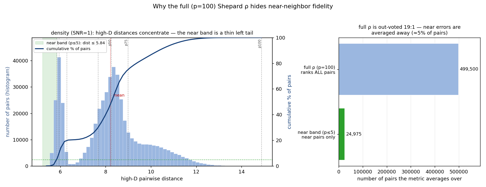
*High-D pairwise-distance profile — why the near band (the profile's first mode) is a slice the full ρ buries*

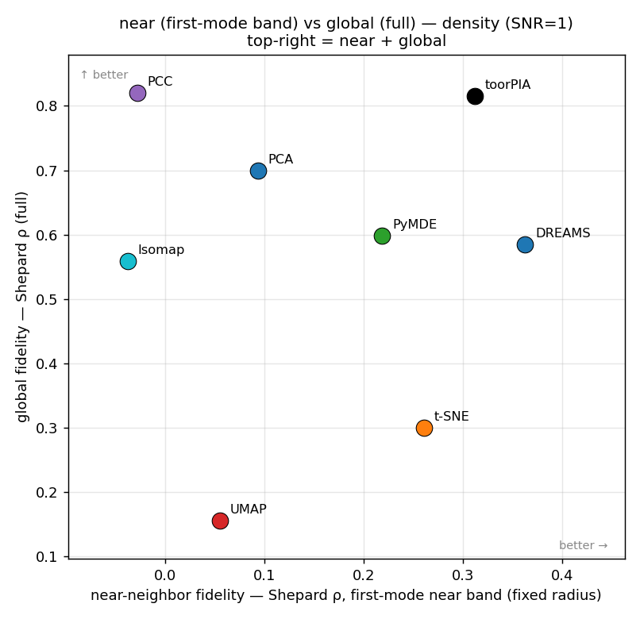
*Near (first-mode band) vs global (full) Shepard ρ — top-right captures both*

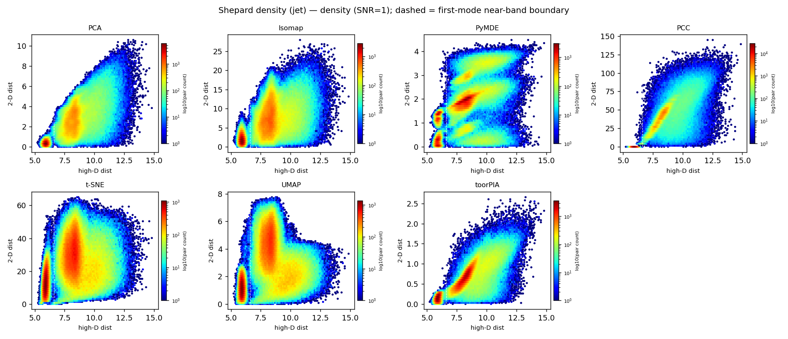
*Shepard density (jet, log counts) — high-D vs 2-D distance*

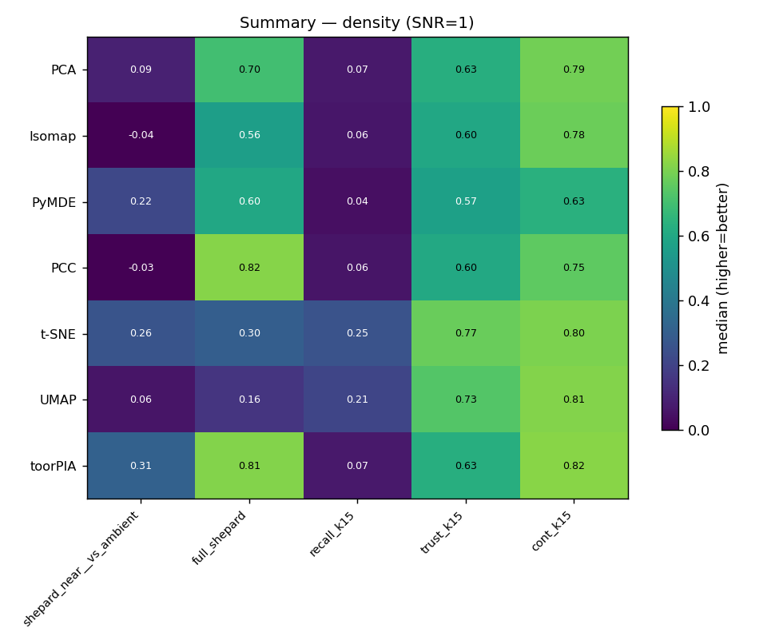
*Summary heatmap (methods × metrics, median)*

## clusters

> Distinct dense sub-populations in a high-dimensional feature space (7 well-separated dense clusters). Tests whether a method keeps the fine within-cluster structure while also placing the clusters correctly.

### SNR = 1

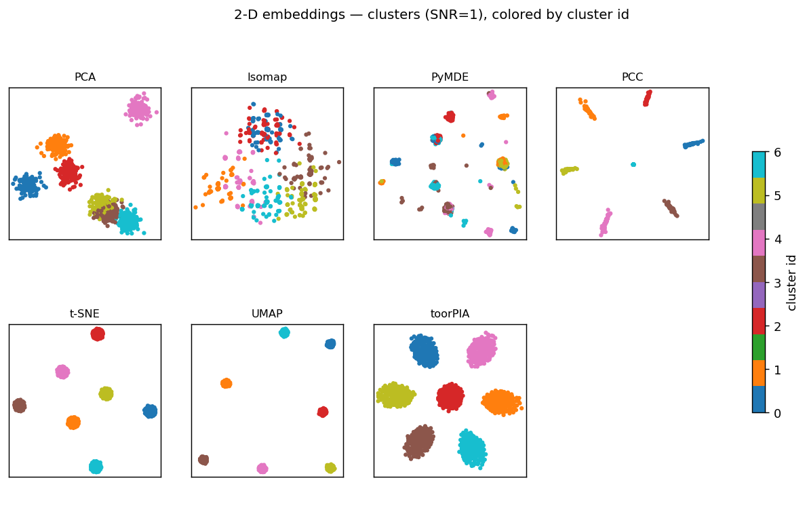
*2-D embeddings colored by the dataset variable*

*Column groups: Distance-fidelity ranking (scores the ρ columns only; 1st→5 … 5th→1 pts) [3 cols] · Band-Shepard ρ — fixed-radius, fair (PRIMARY) [2 cols] · Tightest-cluster scale (× vs overall spread; ≫1 = crushed to a point, ≪1 = inflated) [1 col] · Reference — k-NN-favorable, biased (not a fair neighborhood test) [3 cols]*

| method | full pts | near pts | Σ | full · global | near · first-mode band | tight-cluster scale × | recall@15 | trust@15 | continuity@15 |
|---|---|---|---|---|---|---|---|---|---|
| toorPIA | **5** | 4 | **9** | **0.586** | 0.248 | 0.518 | 0.139 | 0.949 | 0.954 |
| t-SNE | 1 | **5** | 6 | 0.367 [0.364, 0.374] | **0.393 [0.391, 0.394]** | 1.600 [1.587, 1.643] | **0.270 [0.263, 0.271]** | **0.959** | **0.967 [0.967, 0.968]** |
| PyMDE | 4 | 1 | 5 | 0.493 [0.423, 0.519] | 0.111 [0.067, 0.118] | 0.168 [0.159, 1.378] | *0.075 [0.073, 0.087]* | *0.758 [0.736, 0.798]* | *0.827 [0.782, 0.864]* |
| PCC | 3 | 2 | 5 | 0.476 [0.456, 0.480] | 0.132 [0.132, 0.171] | ⚠ **8.857 [6.598, 10.135]** | 0.123 [0.123, 0.128] | 0.945 | 0.947 [0.947, 0.948] |
| PCA | 2 | 3 | 5 | 0.464 | 0.135 | **0.882** | 0.127 | 0.915 | 0.938 |
| UMAP | *0* | *0* | *0* | 0.359 [0.345, 0.366] | 0.093 [0.087, 0.103] | 3.281 [3.124, 3.512] | 0.196 [0.189, 0.198] | 0.949 [0.948, 0.949] | 0.956 [0.956, 0.957] |
| Isomap | *0* | *0* | *0* | *0.337* | ⚠ **-0.056** | 0.440 | 0.089 | 0.869 | 0.885 |

*High-D pairwise-distance profile — why the near band (the profile's first mode) is a slice the full ρ buries*

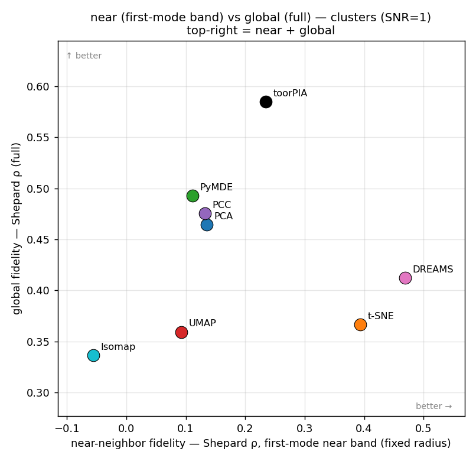
*Near (first-mode band) vs global (full) Shepard ρ — top-right captures both*

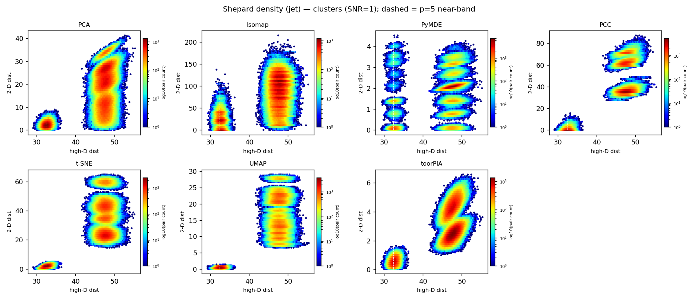
*Shepard density (jet, log counts) — high-D vs 2-D distance*

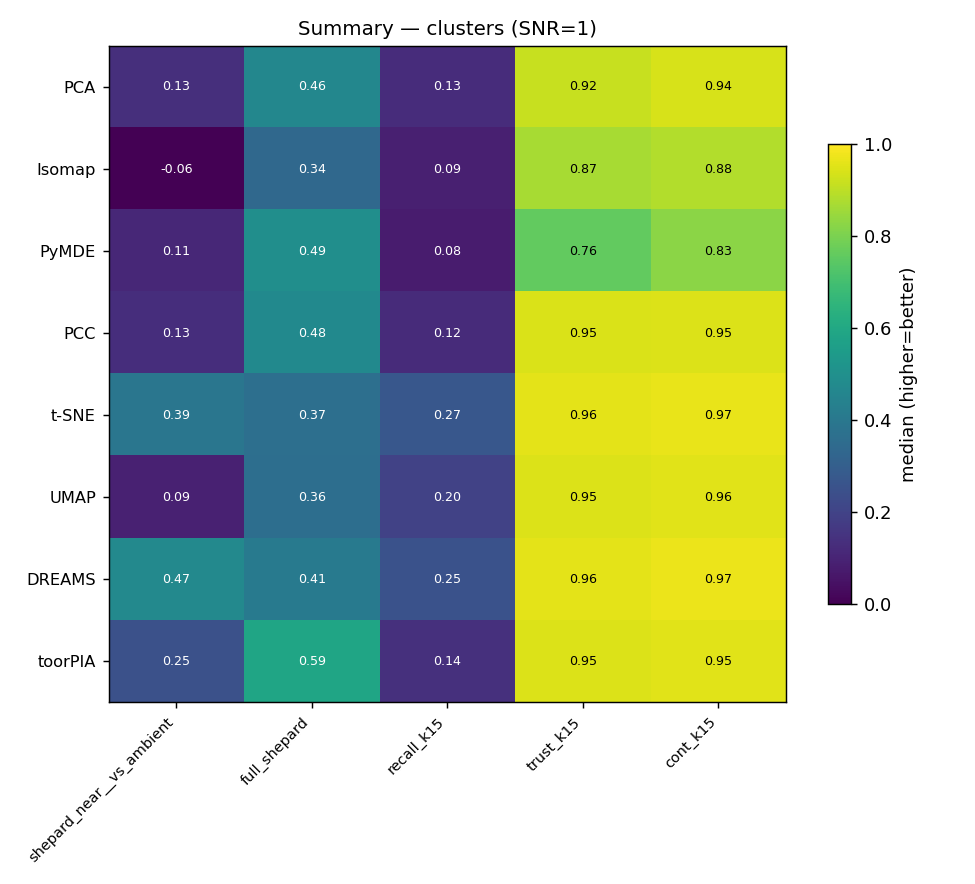
*Summary heatmap (methods × metrics, median)*

## transition

> Continuous transition: dense clusters CONNECTED by bridge regions. The bridges (plus SNR=1 noise) dilute the tightest-cluster over-compression here — PCC's clusters are squeezed but not to points (≈2× under the canonical noise). Included to show the effect is weaker when clusters are connected; toorPIA still preserves scale and leads the global ρ.

### SNR = 1

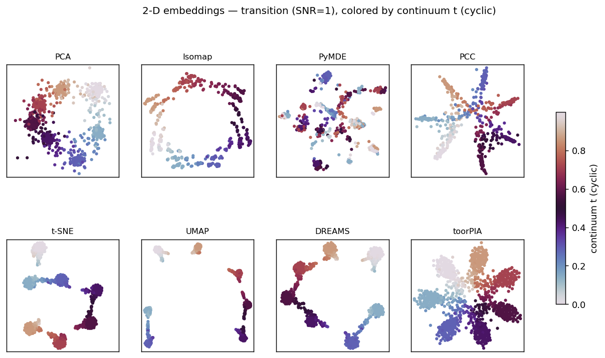
*2-D embeddings colored by the cyclic continuum t. The dataset's defining geometry has two features at once: seven DENSE typical-state clusters, and their CLOSED ring connectivity (state 0 → 1 → … → 6 → 0 through bridges). Read the gallery against both: toorPIA is the only method that reproduces both simultaneously — seven distinct dense lobes arranged in the correct cyclic order with the bridge points between adjacent states. The others each recover at most one feature: Isomap draws the cleanest closed ring but smears the dense clusters along it; PCA keeps the cyclic order in a ragged ring with blurred, overlapping clusters; t-SNE and UMAP recover dense clusters but tear the connecting bridges, fragmenting the loop; PCC draws the seven states as radial spokes fused at a central hub, so every state becomes adjacent to every other and the cyclic adjacency is lost. This qualitative reading sits alongside the quantitative table below: toorPIA holds the best global ρ here (0.729) while its first-mode near ρ trails (6th), which is what drops it to 3rd in the composite*

*Column groups: Distance-fidelity ranking (scores the ρ columns only; 1st→5 … 5th→1 pts) [3 cols] · Band-Shepard ρ — fixed-radius, fair (PRIMARY) [2 cols] · Tightest-cluster scale (× vs overall spread; ≫1 = crushed to a point, ≪1 = inflated) [1 col] · Reference — k-NN-favorable, biased (not a fair neighborhood test) [3 cols]*

| method | full pts | near pts | Σ | full · global | near · first-mode band | tight-cluster scale × | recall@15 | trust@15 | continuity@15 |
|---|---|---|---|---|---|---|---|---|---|
| PCC | 4 | 4 | **8** | 0.640 [0.639, 0.648] | 0.727 [0.725, 0.729] | 2.112 [1.791, 2.140] | 0.204 [0.203, 0.209] | 0.947 [0.947, 0.948] | 0.962 [0.962, 0.964] |
| t-SNE | 2 | **5** | 7 | 0.556 [0.501, 0.559] | **0.753 [0.747, 0.754]** | **1.022 [0.962, 1.042]** | **0.363 [0.363, 0.364]** | **0.974** | **0.976 [0.974, 0.976]** |
| toorPIA | **5** | *0* | 5 | **0.729** | 0.548 | 0.394 | 0.232 | 0.964 | 0.965 |
| PCA | 3 | 2 | 5 | 0.556 | 0.630 | 0.859 | 0.182 | 0.948 | 0.956 |
| UMAP | *0* | 3 | 3 | *0.483 [0.473, 0.491]* | 0.695 [0.694, 0.699] | 2.410 [2.323, 2.490] | 0.292 [0.288, 0.296] | 0.966 [0.966, 0.967] | 0.968 [0.968, 0.968] |
| PyMDE | 1 | *0* | *1* | 0.540 [0.423, 0.581] | *0.310 [0.130, 0.446]* | 0.128 [0.104, 1.777] | *0.155 [0.142, 0.157]* | *0.823 [0.810, 0.833]* | *0.841 [0.711, 0.853]* |
| Isomap | *0* | 1 | *1* | 0.533 | 0.613 | 0.976 | 0.204 | 0.960 | 0.961 |

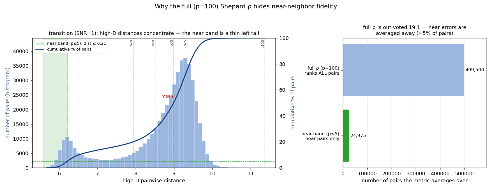
*High-D pairwise-distance profile — why the near band (the profile's first mode) is a slice the full ρ buries*

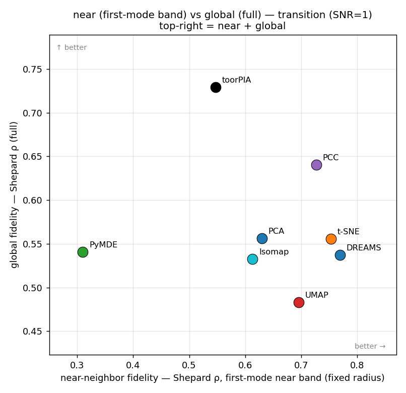
*Near (first-mode band) vs global (full) Shepard ρ — top-right captures both*

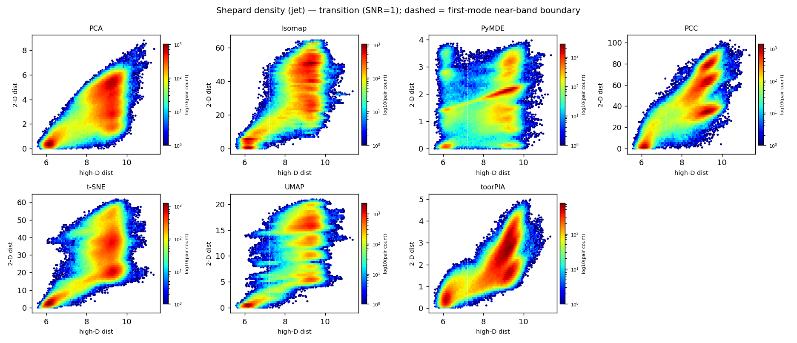
*Shepard density (jet, log counts) — high-D vs 2-D distance*

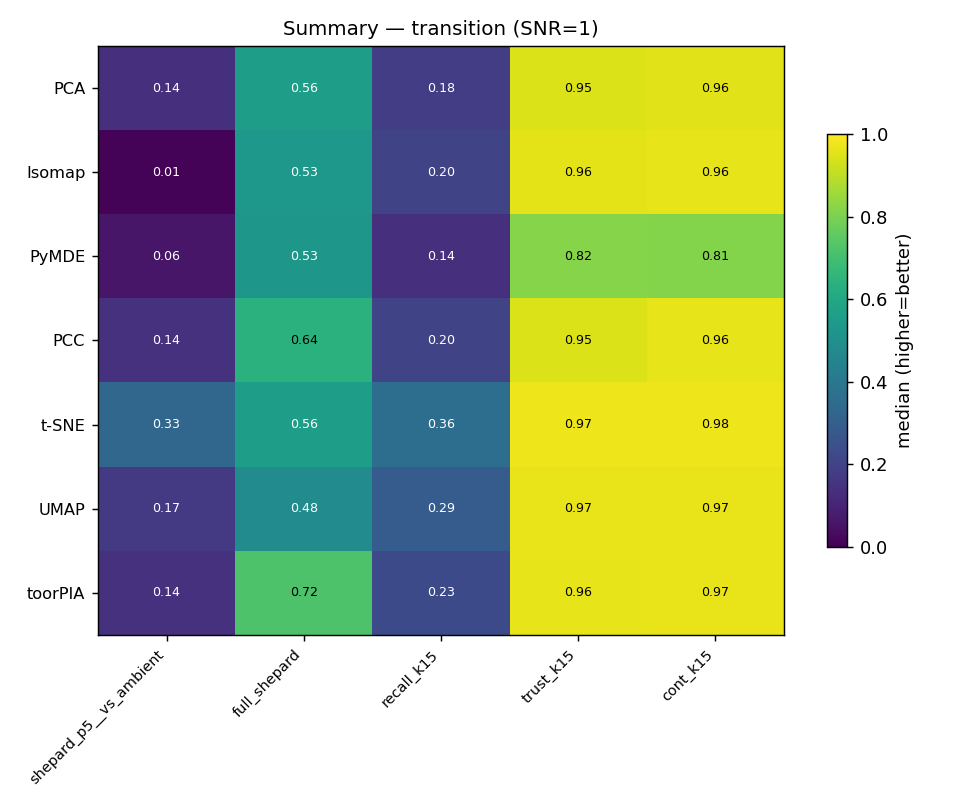
*Summary heatmap (methods × metrics, median)*

## outliers

> Bulk of dense clusters plus 3 anomalous DIRECTIONS × 2 near-duplicate outliers each, at outlier_factor × Rg (bulk radius of gyration) along dedicated directions orthogonal to the bulk's subspace (modeled on a real contamination case: images acquired under a different condition hiding in a feature set). Read it from the two figures first: the Shepard density panel (high-D vs 2-D distance — the outlier-related pair blocks are directly visible, and violations such as same-kind pairs thrown to huge 2-D distances or far pairs collapsed to 0 show up as off-trend blocks) and the star gallery (outliers colored by direction; a/b = the near-duplicate pair). The quantitative anchor is the same standard statistic as everywhere else: the Shepard ρ restricted to the ANOMALY-INVOLVING pairs (the 'outlier ρ' column) — it scores exactly the blocks the density panel shows and feeds the ranking score as a third 5..1 column, so a method that plots its anomalies among other clusters or fuses/tears same-kind pairs scores low there no matter how well it orders the pairs among the normal points.

### SNR = 1

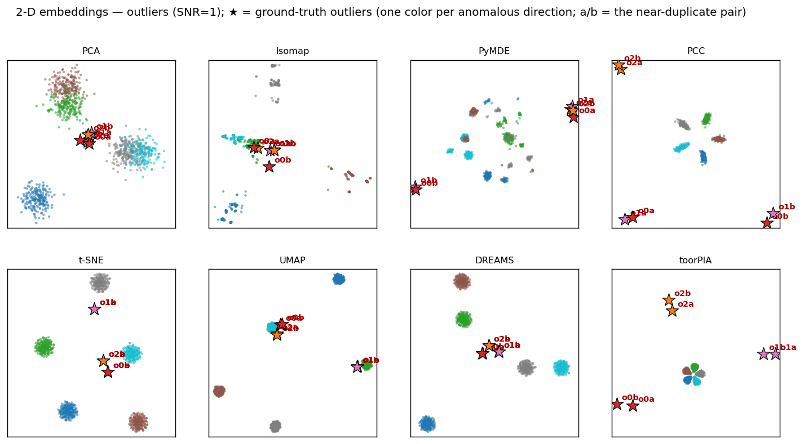
*Embedding gallery, ground-truth outliers starred (one color per anomalous direction; a/b = the near-duplicate pair). toorPIA is the only method that renders the anomalies faithfully INCLUDING the relations among them: each same-kind a/b pair lands adjacent and co-directional (pair angle ≤ 10°), the three kinds point to three separate directions well away from the bulk, and the bulk's 5-cluster layout is kept — the picture behind its outlier ρ 0.615 (1st) and global ρ 0.759 (1st). PCA and Isomap drop the anomalies onto the bulk clusters; PyMDE tears same-kind pairs to opposite ends of the map and fuses different kinds; PCC keeps the bulk clean but throws same-kind pair members to different corners (angles ≈ 86°); t-SNE fuses each a/b pair into a single point among the bulk clusters; UMAP attaches the anomalies to bulk-cluster edges*

*Column groups: Distance-fidelity ranking (scores the ρ columns only; 1st→5 … 5th→1 pts) [4 cols] · Band-Shepard ρ — fixed-radius, fair (PRIMARY) [2 cols] · Tightest-cluster scale (× vs overall spread; ≫1 = crushed to a point, ≪1 = inflated) [1 col] · Reference — k-NN-favorable, biased (not a fair neighborhood test) [3 cols] · Outlier pairs — standard Shepard ρ over anomaly-involving pairs [1 col]*

| method | full pts | near pts | outlier pts | Σ | full · global | near · first-mode band | tight-cluster scale × | recall@15 | trust@15 | continuity@15 | outlier ρ |
|---|---|---|---|---|---|---|---|---|---|---|---|
| toorPIA | **5** | 4 | **5** | **14** | **0.759** | 0.253 | **0.749** | 0.127 | 0.927 | 0.934 | **0.615** |
| PCA | 3 | 3 | 4 | 10 | 0.585 | 0.249 | 1.482 | 0.104 | 0.845 | 0.906 | 0.156 |
| PCC | 4 | 2 | 3 | 9 | 0.707 [0.696, 0.708] | 0.248 [0.242, 0.248] | 2.089 [2.025, 2.171] | 0.125 [0.125, 0.127] | 0.926 [0.926, 0.926] | 0.933 | 0.154 [0.114, 0.164] |
| t-SNE | *0* | **5** | 1 | 6 | 0.481 [0.480, 0.502] | **0.403 [0.401, 0.406]** | 2.417 [2.397, 2.434] | **0.247 [0.246, 0.250]** | **0.944 [0.943, 0.945]** | **0.952 [0.951, 0.952]** | 0.083 [0.047, 0.136] |
| Isomap | 1 | *0* | 2 | 3 | 0.490 | *0.016* | 1.887 | *0.089* | 0.907 | 0.912 | 0.153 |
| PyMDE | 2 | *0* | *0* | 2 | 0.527 [0.506, 0.580] | 0.134 [0.115, 0.141] | 0.722 [0.359, 2.135] | 0.095 [0.090, 0.096] | *0.837 [0.823, 0.846]* | *0.797 [0.777, 0.829]* | *0.033 [0.006, 0.035]* |
| UMAP | *0* | 1 | *0* | *1* | *0.464 [0.459, 0.475]* | 0.158 [0.156, 0.166] | 4.894 [4.578, 4.964] | 0.182 [0.180, 0.182] | 0.929 [0.929, 0.930] | 0.941 [0.940, 0.941] | 0.062 [-0.005, 0.111] |

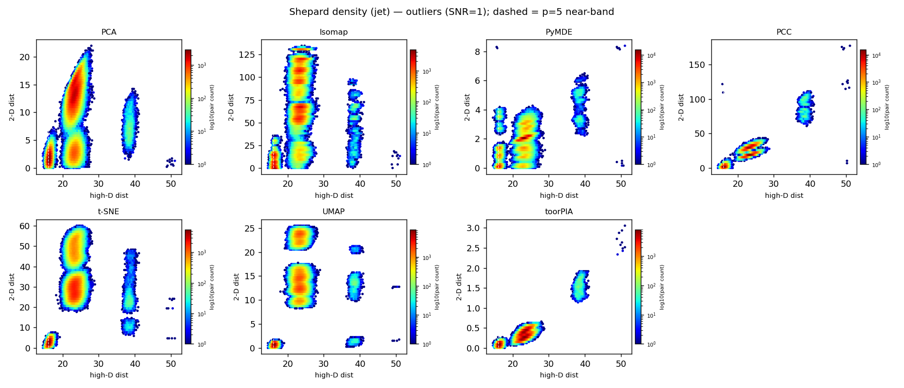
*Shepard density (jet, log counts) — high-D vs 2-D distance*

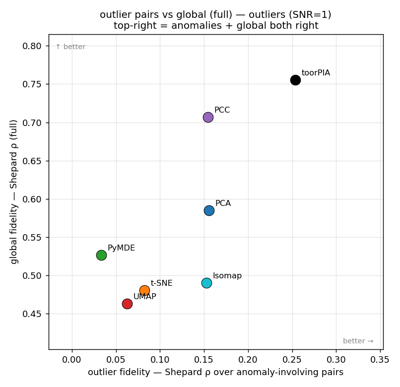
*Outlier-pair ρ vs global (full) ρ — top-right renders both the anomalies and the global layout correctly*

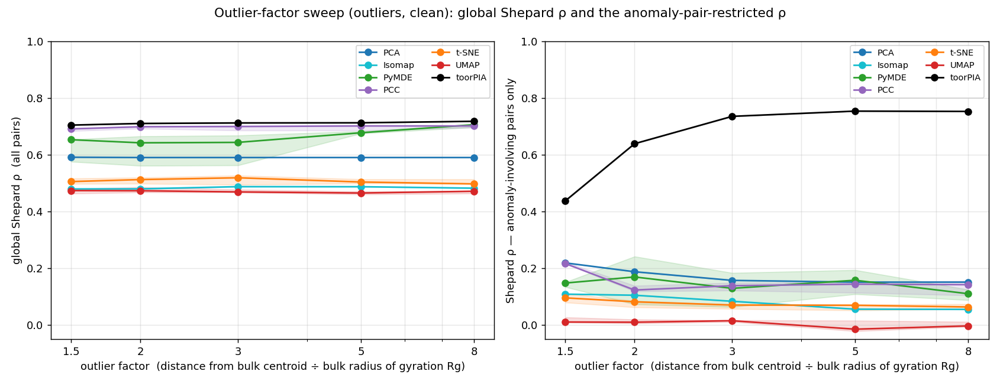
*Sweep vs outlier_factor (clean, CI bands): global Shepard ρ and the anomaly-pair-restricted ρ*

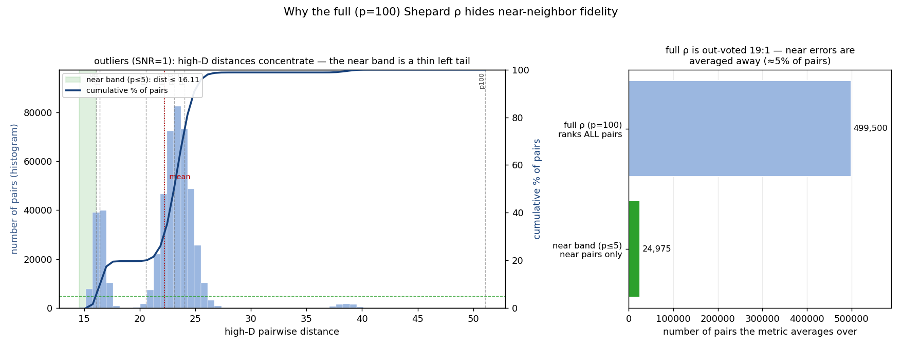
*High-D pairwise-distance profile — why the near band (the profile's first mode) is a slice the full ρ buries*

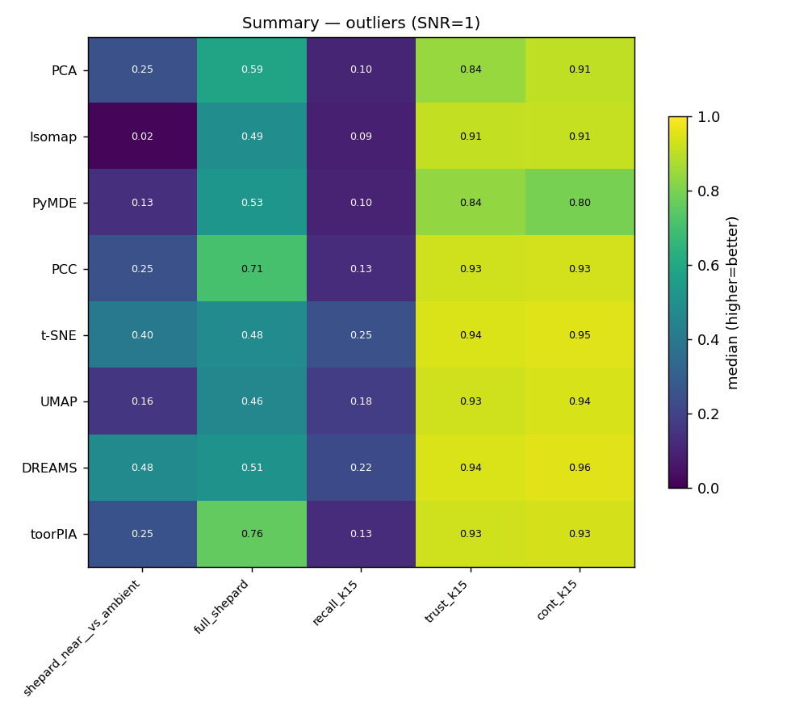
*Summary heatmap (methods × metrics, median)*

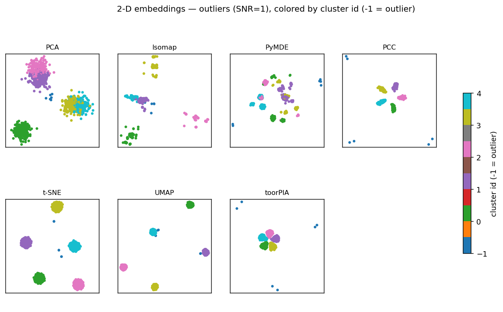
*2-D embeddings colored by the dataset variable*

## imbalanced populations — minority-structure preservation under data imbalance

> Theme: minority-structure preservation under data imbalance. An IMBALANCED pair of populations, each with internal cluster structure: a majority (5 dense clusters) and a much smaller minority (the same 5-cluster geometry, fewer points — default 5%, i.e. 95% vs 5%), placed in disjoint dimension regions and separated so that every cross-population center distance is exactly group_range (=2) × the within-population center distance. Models a ubiquitous real situation: normal production data mixed with a rarely-used operating mode, a main line vs a small pilot-lot series, data before/after an instrument change, or a large healthy cohort vs a small patient group with subtypes. In a real project this composition is UNKNOWN in advance, and the minority is very often the actual object of the analysis (anomaly analysis, positive cases in medical data, transient operating states of a process) — so extracting it from the map needs two readings positive AT ONCE: is the minority drawn as a recognizable separate group (cross-population ρ), and does it KEEP a trustworthy internal structure despite having few points (minority-internal ρ)? A method that fails either one cannot be used for this ubiquitous task. The gallery (circles = majority, triangles = minority) shows both at a glance; the sweep curve reads exactly like the outliers dataset's: global Shepard ρ next to the SAME standard ρ restricted to the minority-involving pairs ([minority]-[minority] plus [minority]-[majority] — one number that drops if either reading fails). Beware the failure is SILENT: the global ρ (left panel, and the table below) can stay high while the minority-pair ρ (right panel) collapses. The table keeps the benchmark's standard two-sided evaluation (global + local Shepard bands); the per-method membership-restricted ρ values are in the results CSVs.

### SNR = 1

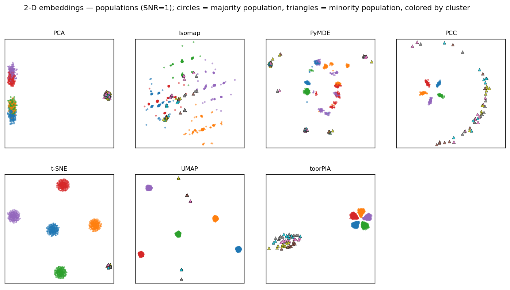
*Embedding gallery at the canonical 95% vs 5% — circles = majority population, triangles = minority population, colored by cluster (0-4 majority, 5-9 minority). PCA draws the minority as a correctly placed featureless blob, PCC strings it out on an arc around the majority (placement rank-uninformative, cross ρ 0.20), t-SNE fuses its five clusters into one tiny clump set apart, UMAP scatters them as islands along the map edge, toorPIA keeps it a recognizable group with internal structure*

*Column groups: Distance-fidelity ranking (scores the ρ columns only; 1st→5 … 5th→1 pts) [3 cols] · Band-Shepard ρ — fixed-radius, fair (PRIMARY) [2 cols] · Tightest-cluster scale (× vs overall spread; ≫1 = crushed to a point, ≪1 = inflated) [1 col] · Reference — k-NN-favorable, biased (not a fair neighborhood test) [3 cols]*

| method | full pts | near pts | Σ | full · global | near · first-mode band | tight-cluster scale × | recall@15 | trust@15 | continuity@15 |
|---|---|---|---|---|---|---|---|---|---|
| toorPIA | **5** | 4 | **9** | **0.813** | 0.254 | 0.728 | 0.138 | 0.935 | 0.938 |
| PCC | 4 | 3 | 7 | 0.761 [0.753, 0.764] | 0.225 [0.222, 0.234] | 2.496 [2.309, 2.650] | 0.133 [0.132, 0.134] | 0.933 [0.930, 0.935] | 0.923 [0.922, 0.936] |
| t-SNE | 1 | **5** | 6 | 0.507 [0.484, 0.518] | **0.371 [0.365, 0.375]** | 2.415 [2.355, 2.438] | **0.275 [0.275, 0.276]** | **0.948** | **0.957 [0.956, 0.957]** |
| PCA | 3 | 2 | 5 | 0.608 | 0.136 | 1.273 | *0.080* | *0.771* | 0.867 |
| PyMDE | 2 | *0* | 2 | 0.595 [0.594, 0.666] | 0.103 [0.089, 0.125] | 0.343 [0.299, 3.383] | 0.104 [0.103, 0.105] | 0.853 [0.817, 0.869] | *0.773 [0.756, 0.817]* |
| UMAP | *0* | 1 | 1 | 0.445 [0.411, 0.466] | 0.108 [0.104, 0.115] | ⚠ **5.407 [4.442, 5.771]** | 0.200 [0.199, 0.202] | 0.934 [0.931, 0.934] | 0.933 [0.933, 0.935] |
| Isomap | *0* | *0* | *0* | *0.346* | ⚠ **-0.022** | **0.913** | 0.096 | 0.883 | 0.879 |

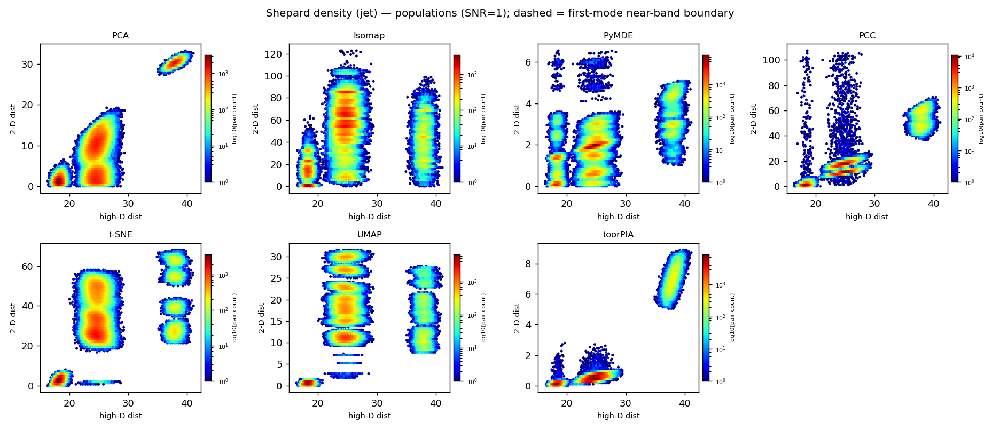
*Shepard density (jet, log counts) — high-D vs 2-D distance*

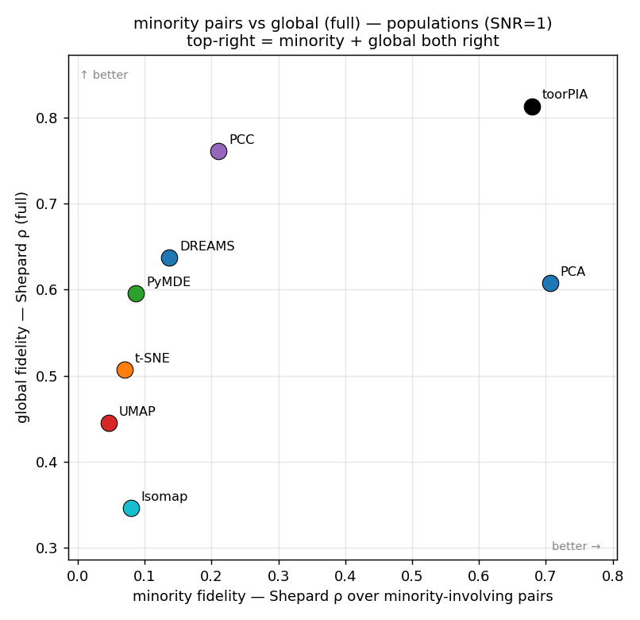
*Minority-pair ρ vs global (full) ρ — top-right renders both the minority population and the global layout correctly*

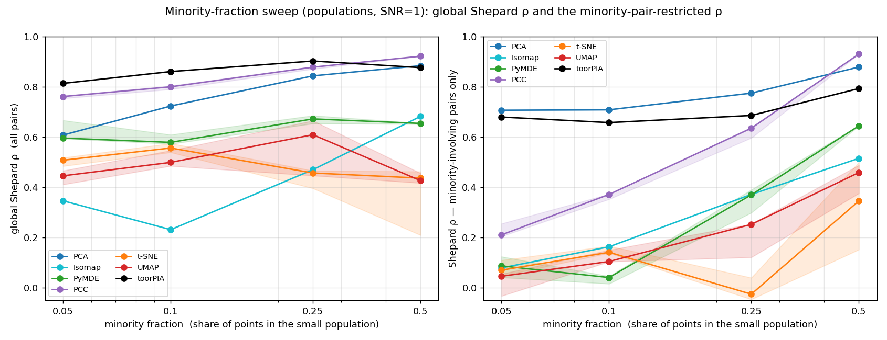
*Sweep vs minority fraction (SNR=1, CI bands): global Shepard ρ and the minority-pair-restricted ρ*

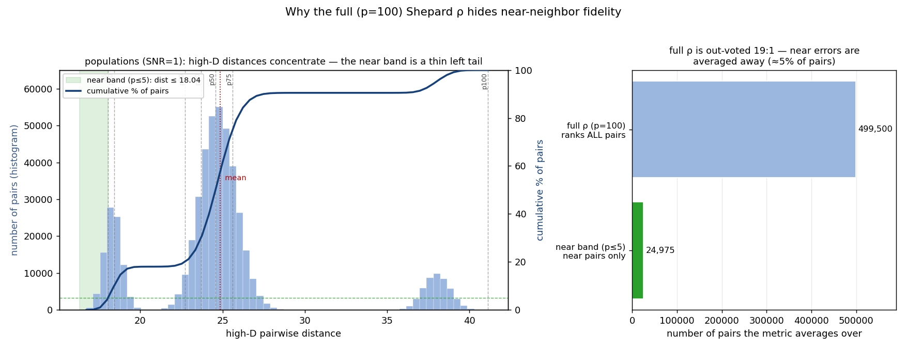
*High-D pairwise-distance profile — why the near band (the profile's first mode) is a slice the full ρ buries*

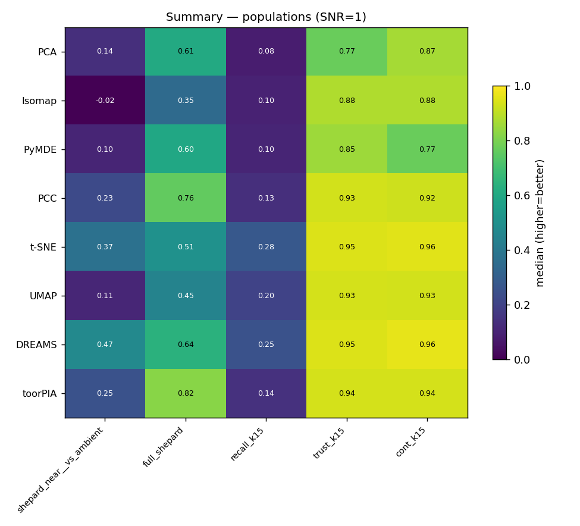
*Summary heatmap (methods × metrics, median)*

## time series — multi-series high-D random walks (continuous change, no clusters)

> Theme: **trajectory rendering — the shape of multivariate time-series data.** Six independent random walks in D=50 (each time step adds an independent uniform displacement in every dimension; all series start at the origin) are concatenated into one dataset of 6 × 500 = 3000 points and embedded together. This is the regime that real multivariate monitoring data lives in — process sensors, equipment logs, longitudinal measurements: **OPEN, filamentary trajectories indexed by (series, time), with no clusters at all** — the structural opposite of the five datasets above. All seven methods run on exactly the main-benchmark footing (toorPIA through the same `basemap_embedding` endpoint).

> **What the data really looks like — read this before the maps.** A random walk in D=50 does not look like the doodle that 2-D intuition suggests. Because every next step is drawn with D fresh degrees of freedom, three geometric facts hold with near-certainty — every panel of the figure below is *measured on the actual dataset*, not drawn schematically. **(1) Radial escape:** the distance from the origin grows as √t (‖x_t‖ ≈ step·√(tD/3)) — in high dimensions the walk never wanders back; each series pushes steadily OUTWARD (panel 2; compare the same recipe in D=2, panel 1, which meanders, recrosses itself, and overlaps its neighbors). **(2) Zigzag at every step (local):** successive steps are independent, and in high dimensions two independent directions are almost surely near-orthogonal — the angle concentrates at 90° with spread ~1/√D ≈ a few degrees (panel 3, blue) — so the trajectory is JAGGED at every single step and never smooths into a curve. **(3) Mutually orthogonal series (global):** the same near-orthogonality holds between the position vectors of different series (panel 3, red), so the six walks radiate along mutually perpendicular directions and never approach one another — every cross-series distance obeys the Pythagorean relation d ≈ √(r_i² + r_j²) (panel 4). The true shape is therefore a **star of six jagged spokes radiating from the shared origin at mutual right angles**. Six mutually orthogonal directions cannot all be drawn at right angles on paper — but a faithful 2-D map must still render what CAN be rendered: one shared origin with the series fanning out separately (never crossing), monotone outward time order along each spoke, and the saw-tooth jitter on top of every spoke.

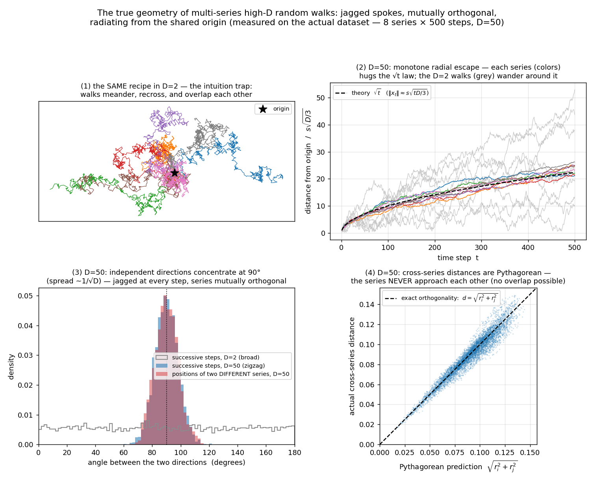
*The geometric ground truth, measured on the actual dataset. (1) The same walk recipe in D=2 — the intuition trap: walks meander, recross, and overlap. (2) In D=50 the distance from the origin hugs the √t law (colored series; grey = the D=2 walks wandering around it): monotone radial escape. (3) Angles between successive steps (blue) and between positions of different series (red) both concentrate at 90° in D=50, while in D=2 they are spread over everything (grey): the walk is jagged at every step, and the series are mutually orthogonal. (4) Cross-series distances match the Pythagorean prediction √(r_i²+r_j²): the series never approach each other.*

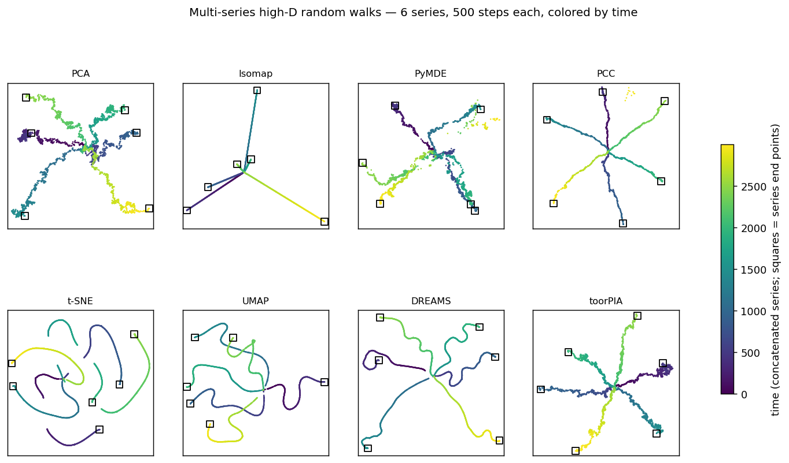
*2-D maps, points colored by time (dark = early, yellow = late; squares = series end points). Read against the three facts above. toorPIA renders the full truth — six jagged spokes radiating separately from one shared origin with clean outward time order (the picture behind its leading within-series 0.970 / cross-series 0.897 / full 0.924 ρ). PCA and PyMDE keep the radial fan but tangle it near the origin (PyMDE also scatters fragments of one series). PCC draws a clean six-spoke star but STRAIGHTENS the spokes — the saw-tooth jitter is visibly smoothed away (its step-structure ρ 0.470 is the lowest of all seven) — and throws a detached patch of one series across the map. Isomap collapses each walk to a nearly straight ray. t-SNE and UMAP cut the walks into smooth, disconnected ribbons scattered over the canvas: the time order along each fragment is beautifully preserved — they lead the step-structure column (0.951 / 0.885), a rank statistic that smoothing does not hurt — but the shared origin and the radial arrangement are gone (cross-series ρ 0.366 / 0.477, the two lowest), and the jitter amplitude, which the rank statistic cannot see, is erased from the picture.*

*Column groups: Trajectory Shepard ρ — the standard statistic, pairs split by (series, time) membership [4 cols]*

| method | full · all pairs | cross-series · star arrangement (GLOBAL) | within-series · trajectory shape | within-series near \|Δt\|≤20 · step structure (LOCAL) |
|---|---|---|---|---|
| toorPIA | **0.924** | **0.897** | **0.970** | 0.627 |
| PCC | 0.861 [0.849, 0.913] | 0.836 [0.827, 0.884] | 0.904 [0.893, 0.958] | *0.470 [0.463, 0.558]* |
| PCA | 0.840 | 0.774 | 0.895 | 0.610 |
| PyMDE | 0.786 [0.771, 0.787] | 0.752 [0.748, 0.755] | 0.779 [0.772, 0.822] | 0.496 [0.485, 0.516] |
| Isomap | 0.682 | 0.604 | *0.728* | 0.622 |
| UMAP | 0.628 [0.571, 0.630] | 0.477 [0.393, 0.480] | 0.854 [0.715, 0.855] | 0.885 [0.882, 0.891] |
| t-SNE | *0.524 [0.484, 0.580]* | *0.366 [0.324, 0.437]* | 0.873 [0.848, 0.911] | **0.951 [0.949, 0.952]** |

> **Honest notes.** (1) **Same footing as the five datasets above:** toorPIA runs through the identical deterministic `basemap_embedding(l2_normalization=False)` endpoint (coordinates committed under `external_embeddings/random_walk/` — offline replay, no API key needed); stochastic methods use R=3 seeds and brackets are bootstrap 95% CIs. (2) **Parameters:** D=50, 6 series × 500 steps, and NO added noise: the walk's own randomness IS the data, and the walk is generated directly in the ambient space, so the ground truth is the ambient geometry itself (vs-truth ≡ vs-ambient) — there is no separate latent space or SNR knob to harmonize with the main grid. D=50 already places the geometry deep in the high-dimensional regime (the angle spread around 90° is ~1/√D ≈ 8°); raising D only tightens the concentration. (3) **Columns:** the standard Spearman ρ with the pair set selected by (series, time) membership — the same construction as the outlier ρ and the minority-pair ρ: *within-series* = both endpoints in the same series; *within-series near* = same series and |Δt| ≤ 20 steps (the step-level saw-tooth; the time-lag window replaces the distance-percentile near band because here "local" is defined by time, not by a mode of the distance profile); *cross-series* = endpoints in different series (the star arrangement); *full* = all pairs. (4) No composite ranking points on this table — the split columns are the reading (rows are ordered by the full ρ; best per column green, worst light red as everywhere). (5) **Reproduce:** `python run/timeseries_probe.py` (defaults: `--ndim 50 --npoints 500 --n-series 6 --lag 20 --seeds 3`).

## Run-to-run stability (Procrustes)

After removing the rotation/reflection/translation/scale gauge: per-point positional dispersion and the std of headline fidelity metrics across seeds. Small dispersion with ~0 metric-std means coordinates may wobble but structural fidelity is stable.

### density

| method | snr | n_runs | position_dispersion | full_shepard__std | full_stress_fidelity__std |
|---|---|---|---|---|---|
| PCC | 1 | 3 | 0.0103 | 0.0033 | 0.0018 |
| PyMDE | 1 | 3 | 0.0130 | 0.0050 | 0.0013 |
| UMAP | 1 | 3 | 0.0064 | 0.0032 | 0.0025 |
| t-SNE | 1 | 3 | 0.0130 | 0.0134 | 0.0042 |

### clusters

| method | snr | n_runs | position_dispersion | full_shepard__std | full_stress_fidelity__std |
|---|---|---|---|---|---|
| PCC | 1 | 3 | 0.0139 | 0.0104 | 0.0010 |
| PyMDE | 1 | 3 | 0.0143 | 0.0406 | 0.0087 |
| UMAP | 1 | 3 | 0.0140 | 0.0087 | 0.0062 |
| t-SNE | 1 | 3 | 0.0121 | 0.0040 | 0.0031 |

### transition

| method | snr | n_runs | position_dispersion | full_shepard__std | full_stress_fidelity__std |
|---|---|---|---|---|---|
| PCC | 1 | 3 | 0.0125 | 0.0041 | 0.0008 |
| PyMDE | 1 | 3 | 0.0137 | 0.0671 | 0.0031 |
| UMAP | 1 | 3 | 0.0040 | 0.0072 | 0.0020 |
| t-SNE | 1 | 3 | 0.0062 | 0.0265 | 0.0126 |

### outliers

| method | snr | n_runs | position_dispersion | full_shepard__std | full_stress_fidelity__std |
|---|---|---|---|---|---|
| PCC | 1 | 3 | 0.0136 | 0.0053 | 0.0013 |
| PyMDE | 1 | 3 | 0.0140 | 0.0314 | 0.0063 |
| UMAP | 1 | 3 | 0.0116 | 0.0065 | 0.0042 |
| t-SNE | 1 | 3 | 0.0129 | 0.0100 | 0.0021 |

### imbalanced populations

| method | snr | n_runs | position_dispersion | full_shepard__std | full_stress_fidelity__std |
|---|---|---|---|---|---|
| PCC | 1 | 3 | 0.0126 | 0.0045 | 0.0028 |
| PyMDE | 1 | 3 | 0.0133 | 0.0338 | 0.0082 |
| UMAP | 1 | 3 | 0.0082 | 0.0227 | 0.0057 |
| t-SNE | 1 | 3 | 0.0134 | 0.0140 | 0.0066 |

## Methodology notes

> **Why bands (and how the near band is defined).** Shepard ρ over *all* pairs measures global-structure reproduction, but high-dimensional distance concentration packs most pairs into a narrow far band, so the full ρ is dominated by far pairs and near-distance accuracy is buried. The fixed percentile cutoffs (the band at p holds the lowest p% of all pairs; p = 5…100 in the CSVs and the profile figures) expose the near→far profile; the HEADLINE near band is **structure-adaptive**: the pairwise-distance profile of structured data is multimodal — its first mode is the within-structure pairs — and the band is all pairs up to the density valley where that first mode decays into the tail. Estimator (`metrics.distances.first_mode_threshold`; deterministic, all pairs, constants disclosed): histogram over 256 equal-width bins, smoothed twice with a length-9 boxcar; the boundary is the profile minimum between the first two local maxima (order 4; a mode must reach ≥5% of the profile maximum, and the valley must dip below 95% of the first mode — tail-noise bumps are not modes), required to lie below the median distance; if no second mode exists the band falls back to the 5th-percentile radius (flagged in the CSVs; never triggered on these datasets). At SNR=1 the boundary lands at p20.5 (density), p14.2 (clusters), p14.9 (transition), p19.7 (outliers), p18.0 (populations) — on the three clustered datasets this coincides exactly with the true within-cluster pair fraction (14.2% / 19.7% / 18.0%), i.e. the data-driven band recovers the ground-truth notion of "near" without using labels. The detected percentile and fallback flag are recorded per row (`near_band_pct`, `near_band_fallback`).

> **Fixed-radius (fair) vs variable-radius (biased).** The band uses one absolute distance threshold for the whole dataset — every point is judged on the same radius. **recall@k / trustworthiness / continuity** instead take each point's own k nearest (a per-point variable radius) with a hard inclusion threshold; they over-penalize near-ties in dense regions and are structurally favorable to k-NN-based methods (t-SNE/UMAP). They are **not a correct neighborhood evaluation** and are reported as a biased reference only. (A per-point band-Shepard variant exists for contrast, but it re-introduces the variable radius, so the fixed-radius global band is primary.)

> **Density-weighting caveat.** On non-uniform-density data the global first-mode band is weighted toward dense regions, so the near ρ emphasizes near-structure where pairs are dense. A per-point-uniform view is the (variable-radius) per-point variant — the trade-off is point-uniformity vs fixed-radius fairness.

> **Non-circularity.** PCC is run with the Pearson (value) loss while the primary metric is Spearman (rank) Shepard ρ — optimizing Pearson yet scoring on the rank metric is the honest, non-circular outcome.

> **PCC crushes dense clusters (scale collapse).** PCC squeezes each dense cluster to a near-point in 2-D (tightest-cluster over-compression ≫1) while keeping high global ρ. Mechanistically this follows from its published objective (arXiv:2503.07609), which optimizes only distances to a sampled set of reference points, leaving non-reference points free to overlap; methods that constrain all pairwise distances keep the local scale. Note the rank-based Shepard ρ is scale-invariant and largely misses this — the tightest-cluster scale metric and the Shepard density plots are what reveal it.

> **Outliers dataset — how it is scored.** Anchored in the standard, established readings only: the Shepard density figure (high-D vs 2-D pairwise distance — the outlier-related pair blocks and their violations are directly visible), the standard band-Shepard ρ / stress blocks over exact pairwise distances, and one plain-geometry column (the same-kind pair angle, truth 0°) plus the addplot kind-assignment accuracy below — both direct readouts of the embedding pictures, with no bespoke normalization. An earlier bespoke ratio metric (OSP) computed for this dataset was **retired from all reporting**: it is not an established metric and its double normalization did not track the Shepard/embedding pictures; its raw columns remain in the per-run CSVs for the record.

> **toorPIA.** Called via the embedding endpoint `basemap_embedding(X, l2_normalization=False)` (toorpia 1.2.0): no per-column normalization, no centering, and per-row L2 normalization disabled, so it embeds the very same raw vectors the other methods see and the plain-Euclidean metrics measure (preprocessing aligned with the evaluation basis). The endpoint exposes no random seed and is deterministic up to server jitter (measured run-to-run mean |Δ| ≈ 1e-3 of the map scale), so toorPIA is treated as a deterministic method: point values without CI brackets, and no run-to-run stability row. Coordinates are cached/committed for offline reproduction (no API key needed).

> **Baseline hyperparameters.** The open-source methods run at library defaults (t-SNE perplexity=30, UMAP n_neighbors=15; toorPIA has no placement knob), so the standing objection is "the neighbor methods would rank differently if tuned". `run/hyperparam_sensitivity.py` sweeps each method's placement-critical knob over 5–100 on density and clusters (SNR=1, R=3): raising t-SNE's perplexity moves BOTH ranked columns materially. On density, perplexity=100 lifts its full ρ from 0.30 to 0.60 (bottom tier → mid-pack, still below PCA 0.70 / toorPIA 0.82 / PCC 0.82) and its first-mode near ρ from 0.26 to 0.41 — at perplexity ≥ 50 t-SNE overtakes toorPIA's density near ρ (0.31); on clusters its near ρ rises 0.39 → 0.54 (a lead it already held) while its full ρ stays flat at 0.37. Even re-scored with those tuned values the composite leaders do not change (density: toorPIA 8 vs t-SNE 7; clusters: toorPIA 9 vs t-SNE 6), and the same settings erode t-SNE's own reference metric (recall@15: 0.254 → 0.230 on density, 0.270 → 0.208 on clusters) — the global-vs-local trade-off is intrinsic to the method, not an artifact of the default. UMAP's gains are small everywhere (full ρ 0.16 → 0.26 on density, still last tier; near and recall flat-to-declining beyond n_neighbors ≈ 15–30). Defaults therefore do not decide any leadership — but tuned t-SNE's near-band standing on density is a genuine sensitivity, disclosed here. Full tables: `results/hyperparam_sensitivity_*.csv`.

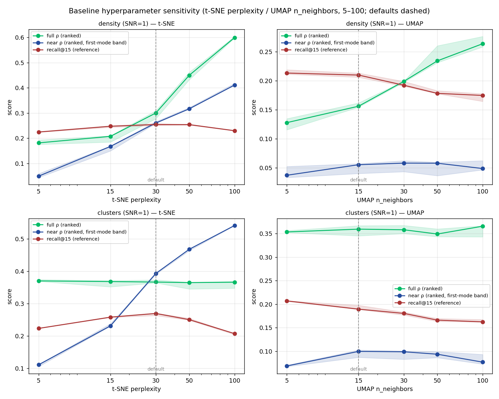
*Baseline-hyperparameter sensitivity (SNR=1, median + bootstrap 95% CI over 3 seeds; library default dashed). Green/blue = the two ranked ρ columns; red = the k-NN-favorable reference metric the neighbor methods lead. Raising t-SNE's perplexity buys global and near-band ρ at the cost of its own recall@15; no setting changes the composite leaders.*

> **Scope.** This characterizes distance/structure preservation on synthetic known-structure data; it is not a claim about downstream-task superiority. When CIs overlap, no strict winner is asserted.

## Supplement — addplot / out-of-sample test (operational criterion)

> **The monitoring scenario:** the basemap is fitted on NORMAL data only (no anomaly ever seen at fit time) and new points arrive afterwards, one at a time. The added set holds **cluster-anchored anomalies** — each shares a normal cluster's profile in the measured features and deviates 3 Rg along new dimensions orthogonal to everything the normal data varies in (a near-duplicate pair per cluster, 5 clusters × 2), the realistic shape of a fault: a known operating state plus an effect the historical data never showed — plus 50 fresh normal points as controls. Each method maps them with its own out-of-sample operation (PCA/Isomap: `transform`; UMAP: seeded `transform`; toorPIA: server-side `addplot_embedding` on the fitted basemap). **Two questions, in order: detection** — does the anomaly land visibly outside the normal region at all (distance from the map centroid over the bulk's median radius)? — and **attribution** — is its direction from the centroid closest to its own source cluster's direction? The direction of an addplot point is information: it should say WHICH normal condition the anomaly departed from. The ambient high-D features resolve attribution 10/10 (the anchor signal survives SNR=1 noise), so a faithful map can too. **t-SNE (sklearn), PyMDE, and PCC expose no out-of-sample operation at all** — for monitoring that is itself the finding: adding data means re-fitting, and a re-fit re-arranges the map.

| method | anomaly distance ÷ bulk radius (med) | min | source-cluster attribution acc. | angle to own cluster ° (med) | same-pair angle ° (med) | bulk-control ratio (≈1 ideal) |
|---|---|---|---|---|---|---|
| PCA | 0.966 | 0.687 | 0.800 | 3.310 | 5.025 | 0.874 |
| Isomap | 1.337 | 0.755 | 0.900 | 7.203 | 1.932 | 1.011 |
| PyMDE | not operable: pymde optimizes fit coordinates; no transform |  |  |  |  |  |
| PCC | not operable: pccdr optimizes fit coordinates; no transform |  |  |  |  |  |
| t-SNE | not operable: sklearn TSNE has no out-of-sample transform |  |  |  |  |  |
| UMAP | 0.971 [0.962, 1.042] | 0.281 [0.261, 0.486] | 1.000 | 3.334 [2.176, 3.429] | 1.559 [1.220, 3.801] | 0.939 [0.935, 1.003] |
| toorPIA | 9.702 | 8.617 | 1.000 | 1.014 | 1.730 | 0.930 |

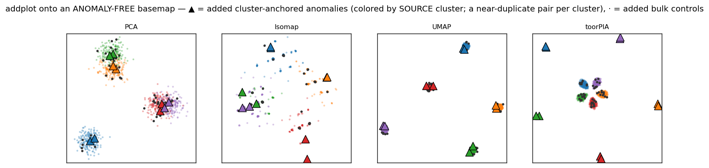
*Anomaly-free basemap (normal clusters, faint colors) + added points (▲ = cluster-anchored anomalies colored by SOURCE cluster, · = added normal controls). Faithful = each ▲ outside the normal region AND in its own cluster's direction, pair members adjacent; dots inside the bulk.*

> **Honest notes.** (1) toorPIA's `addplot_embedding` targets the fitted basemap's server-side state, so this test performs a live `basemap_embedding(l2_normalization=False)` + one `addplot_embedding` call per added point (the monitoring semantics: points arrive one at a time) and commits the two coordinate sets as a self-consistent cache pair (`embedding_basemap` / `embedding_addplot`); the addplot inherits the basemap's preprocessing server-side, so basemap and added points are guaranteed identical treatment. (2) PCA/Isomap transforms and toorPIA are deterministic; UMAP's is seeded. (3) A re-fit-based alternative for the methods without an out-of-sample operation (append the new data, re-fit, Procrustes-align, measure displacement) is future work — it measures a different, weaker property (map stability under re-fit), not the monitoring operation itself.

## Supplement — noise-dims dimension sweep (when dimensionality itself is the noise)

> **Why this supplement exists.** It makes a two-stage point about toorPIA under noise dimensions. **Stage 1:** on the same footing as the main benchmark — the raw-geometry `basemap_embedding` endpoint — toorPIA already tolerates noise dimensions better than every generic method. **Stage 2:** toorPIA additionally ships `basemap_csvform`, its **default endpoint for CSV/tabular data analysis** (a distinct pipeline with per-item preprocessing), and that endpoint shows an extraordinary tolerance to noise dimensions — it is essentially indifferent to them out to hundreds of pure-noise columns. This second point is what a practitioner needs for real tabular data, where irrelevant columns are numerous and their number is unknown in advance — and it is the reason this probe is a supplement rather than a sixth dataset row. **Two noise regimes.** The five datasets above share one deliberately noise-friendly design: the random orthonormal projection spreads every latent factor across all D=768 ambient columns (D-fold redundancy), so the driver's isotropic noise self-averages in every pairwise distance and the ambient dimension is nominal — no curse of dimensionality operates, *by construction*. Real CSV data is usually the opposite: the signal lives in a few columns and every further column mostly adds noise. This probe is that regime in its pure form: 3 tight clusters live in 3 signal columns and every additional column is pure unit-variance noise (per-column standardized), so each added dimension adds noise power at fixed signal power — the effective SNR is 3/(D−3) and falls toward 0 as D grows. The readout is the **kNN label accuracy** — the direct operational answer to "are the three true clusters still visible in the 2-D map?" — shown both absolute and as the chance-corrected **skill ratio against kNN run directly on the raw D-dimensional features** (the ambient baseline: what a practitioner gets with no dimensionality reduction at all). **Stage-1 reading (same endpoint as the main benchmark):** the six generic methods collapse between D≈40 and 200; `basemap_embedding` instead tracks the ambient baseline itself (skill ratio ≈ 1: the 2-D map delivers essentially everything the raw feature space's neighborhoods still contain) and at D=200 stands at **0.75 vs ≤ 0.51** for the best generic method; its own breaking regime starts an octave later (D≈250–400, realization-sensitive: 0.57 / 0.33 / 0.44 at D=250/300/400). **Stage-2 reading:** `basemap_csvform` is unaffected where every raw-geometry method — toorPIA's own embedding endpoint included — has already collapsed: **1.00 at D=200–300, 0.99 at D=400, 0.98 at D=768** (effective SNR ≈ 0.004), 0.92 at D=1500, first breaking at D=2000. Its skill ratio grows to ≈ 2.8 at D=768 and ≈ 3.9 at D=1500 — the 2-D map reads roughly three to four times more above-chance class signal than kNN on the raw features themselves. The probe is deliberately NOT a sixth registry dataset: its ground truth (the 3 signal columns) is intentionally not isometric to the ambient features, and distance-band Shepard ρ is deliberately not shown here: a global ρ is only meaningful paired with its near band (the point of this benchmark's methodology), and neither band reads cleanly against this probe's noise-dominated ambient distances — the full metric set remains in `results/dimsweep_per_run.csv`. Read the results as **regime dependence** — rankings from the redundancy-rich datasets above need not transfer to sparse/irrelevant-feature regimes, and vice versa.

*Column groups: 2-D kNN label accuracy (chance = 1/3) [9 cols]*

| method | D=6 | D=40 | D=80 | D=200 | D=250 | D=300 | D=768 | D=1500 | D=2000 |
|---|---|---|---|---|---|---|---|---|---|
| PCA | 1.000 | 0.999 | 0.918 | 0.483 | 0.590 | 0.517 | 0.387 | — | — |
| Isomap | 1.000 | 0.973 | 0.757 | 0.416 | 0.349 | 0.371 | 0.354 | — | — |
| PyMDE | 0.990 [0.988, 0.992] | 0.555 [0.480, 0.687] | 0.412 [0.337, 0.441] | 0.328 [0.309, 0.376] | 0.337 [0.336, 0.348] | 0.349 [0.327, 0.353] | 0.328 [0.300, 0.361] | — | — |
| PCC | 0.994 [0.987, 0.996] | 0.964 [0.952, 0.967] | 0.717 [0.540, 0.752] | 0.388 [0.381, 0.466] | 0.378 [0.376, 0.406] | 0.393 [0.375, 0.406] | 0.381 [0.341, 0.382] | — | — |
| t-SNE | 1.000 | 0.982 [0.973, 0.988] | 0.850 [0.842, 0.862] | 0.506 [0.496, 0.532] | 0.464 [0.457, 0.486] | 0.492 [0.466, 0.498] | 0.383 [0.382, 0.405] | — | — |
| UMAP | 1.000 | 0.995 [0.994, 0.996] | 0.904 [0.901, 0.915] | 0.460 [0.422, 0.502] | 0.436 [0.405, 0.444] | 0.413 [0.413, 0.425] | 0.377 [0.362, 0.387] | — | — |
| toorPIA (basemap_embedding) | 0.995 | 0.999 | 0.971 | 0.754 | 0.566 | 0.329 | 0.329 | — | — |
| toorPIA (basemap_csvform) | 1.000 | 0.995 | 1.000 | 1.000 | 1.000 | 0.999 | 0.975 [0.974, 0.976] | 0.922 [0.912, 0.927] | 0.736 [0.645, 0.882] |

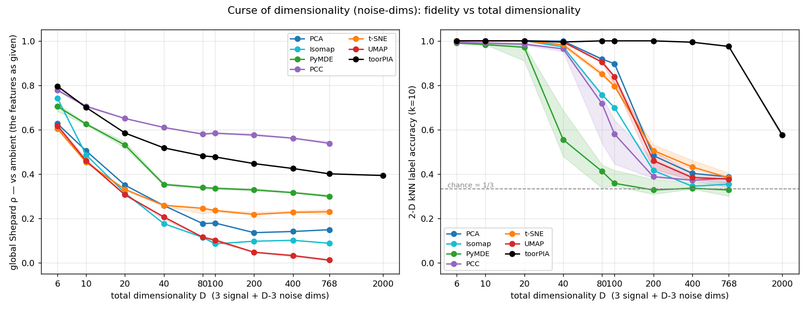
*Left: 2-D kNN label accuracy vs total dimensionality D (log10 axis; chance = 1/3 dashed; dotted grey = the ambient baseline, kNN run directly on the raw D-dim features); median + bootstrap 95% CI ribbon per method. Right: the same data as the chance-corrected skill ratio against that ambient baseline — ratio 1 = as class-readable as the raw feature space itself. toorPIA's two endpoints are the solid lines (generic methods dashed): basemap_embedding (grey) tracks the ambient baseline until its breaking regime at D≈250–400; basemap_csvform (black) is unaffected out to D=768 and reaches skill ratio ≈ 3.9 at D=1500. The D=1500 and D=2000 points pool 5 noise realizations × 3 method seeds each, so their ribbons show realization spread.*

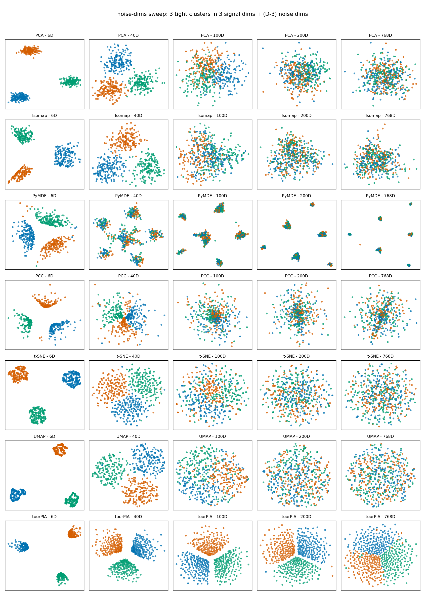
*2-D embeddings at landmark dimensions, 3 true clusters colored — watch where each method's clusters dissolve as noise dimensions are added. The last two rows are toorPIA's two endpoints: basemap_embedding dissolves in the D≈250–400 breaking regime like a raw-geometry method, while basemap_csvform keeps the three clusters cleanly separated through D=768.*

> **Honest notes.** (1) **Endpoints:** the `basemap_csvform` rows drive the default CSV-analysis pipeline (it exposes `random_seed`, hence R=3 seeds and CI brackets; the sweep drives the same engine through its DataFrame form — spot-verified against a direct `basemap_csvform` call at D=768: pairwise-distance ρ 0.998, kNN accuracy 0.975 vs 0.976; committed coordinates under `external_embeddings/noise_dims/toorpia/fit/`). The `basemap_embedding` rows drive the deterministic raw-geometry endpoint the main benchmark uses (single run per D; coordinates under `external_embeddings/noise_dims/toorpia/embedding/`; tables in `results/dimsweep_embedding_*.csv`). Each D is one noise realization, so values inside a breaking regime fluctuate between adjacent D (the embedding endpoint's 0.57 / 0.33 / 0.44 at D=250/300/400 is that fluctuation, not a recovery). (1b) **Ambient baseline / skill ratio:** the baseline is leave-one-out kNN run directly on the raw standardized D-dim features — an operational reference (what no dimensionality reduction at all would give), not an information ceiling. The ratio is chance-corrected, (acc − 1/3)/(accambient − 1/3), because both accuracies approach chance (not 0) as D grows — the raw uncorrected ratio of a fully collapsed method would drift toward 1 instead of 0. Above D≈1000 the denominator itself is small (ambient 0.48 at D=1500, 0.44 at D=2000), so the ratio is increasingly noise-sensitive there. (2) n=1000, matching both the main benchmark and the source notebook. (3) toorPIA is additionally probed at **D=2000** (effective SNR ≈ 0.0015); the other methods are already at chance well before D=768, so the extension is run for toorPIA only (the empty cells read as 'not run', not as failures). At this extreme the outcome is **noise-realization dependent** (the signature of a critical regime), so the D=1500 and D=2000 cells each aggregate **5 independent noise realizations × 3 method seeds** (data seeds 42, 0–3): at D=1500 the realizations agree (0.90–0.93) while at D=2000 they span 0.58–0.88; D ≤ 768 cells use one realization — realization variance is negligible below the breaking regime. (4) Bracketed ranges are bootstrap 95% CIs over seeds; deterministic methods show a point value. (5) kNN label accuracy is leave-one-out in the 2-D embedding (k=10; 3 balanced clusters, chance = 1/3). (6) Reproduce: `python run/dimsweep.py --dims 6 10 20 40 80 100 200 250 300 400 768 --methods all --seeds 3 --n 1000`, then `python run/dimsweep.py --dims 1500 2000 --methods toorPIA --seeds 3 --n 1000 --data-seed 42 0 1 2 3` (results merge by (dim, data_seed, method, seed)); the embedding arm: `python run/dimsweep.py --dims 6 10 20 40 80 100 200 250 300 400 768 --methods toorPIA --toorpia-endpoint embedding`; figures: `python run/dimsweep.py --figures-only`. The committed toorPIA caches make every replay offline.

---

Generated by `run/make_report.py` from `results/metrics_aggregated.csv` + `results/stability.csv` (+ `results/dimsweep_aggregated.csv` for the noise-dims supplement; reproduce it with `python run/dimsweep.py --dims 6 10 20 40 80 100 200 400 768 --methods all --seeds 3 --n 1000` plus `--dims 1500 2000 --methods toorPIA --data-seed 42 0 1 2 3`). This page shows **SNR=1** (realistic additive noise). Reproduce the full SNR sweep with `python run/benchmark.py --dataset all --methods all --seeds 3 --dim 768 --n 1000 --snr inf 4 1` (or just the reported level with `--snr 1`), then rebuild this page with `python run/make_report.py`. Code, data, and the full methodology (`README.md`) live in the [GitHub repository](https://github.com/toorpia/dr-fidelity-benchmark).

